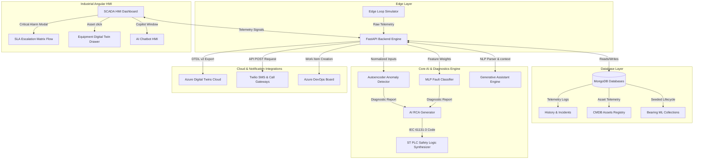

# AetherTwin AI: Presentation Guide & Project Flow

This guide outlines a comprehensive presentation flow, system architecture, and script checkpoints to pitch AetherTwin AI as a production-ready **Generative Digital Twin & Industrial Automation Copilot**.

---

## 🖼️ System Architecture Diagram

---

## 🚦 Phase-by-Phase Presentation Flow

This 4-step demonstration flow walks through a real-world industrial incident lifecycle:

### Step 1: Normal Operations & Equipment Digital Twin
*   **Action**: Select the **Azure Digital Twin (DTDL)** tab. Show the full-width **Configuration Management Database (CMDB)** registry.
*   **Talking Points**:
    *   Explain that the AetherTwin CMDB synchronizes with physical assets.
    *   Click on **Auxiliary Booster Pump (P-102)** to open the **Equipment Digital Twin** card.
    *   Showcase the 8 integrated properties: Live status, historical trends, maintenance history logs, drawing specs, manuals, active PLC references, installed spare parts (Deep Groove Ball Bearing `SKF-6306-2RS1`), and authorized vendor contacts.
*   **Dialogue**:
    > *"Here is our asset registry. Clicking on P-102 opens its Equipment Digital Twin. We can audit its live status, drawing links, historical maintenance, and spare parts. This eliminates paper records, storing critical telemetry and vendor profiles directly in MongoDB."*

### Step 2: Anomaly Injection & SLA Escalation Flow
*   **Action**: Toggle back to the **SCADA Simulator** tab. Click **Trigger Anomaly** (e.g., Pump Cavitation).
*   **Talking Points**:
    *   The dynamic SVG piping lights up red, alert horns sound, and the **Critical Alarm Modal** pops up.
    *   Explain the **Alarm Escalation SLA Matrix** showing Step 1 (Incident Ticket) is complete.
    *   Toggle **⏩ Fast-Forward (20x)** to speed up the simulation.
    *   Watch the timeline markers activate in seconds:
        *   `[30s]`: Voice Bot Automated Call.
        *   `[2 Min]`: Level 1 Shift Engineer Twilio SMS dispatched.
        *   `[5 Min]`: Level 2 Maintenance Manager notified.
        *   `[10 Min]`: Plant Head authorized critical safety interlocks.
*   **Dialogue**:
    > *"When cavitation occurs, an incident ticket is instantly created. Under our SLA Escalation Matrix, if the operator doesn't acknowledge the alarm within 30 seconds, AetherTwin places an automated voice bot call. At 2 minutes, the Shift Engineer is texted via Twilio. We can fast-forward this demonstration to see the steps light up."*

### Step 3: AI RCA & Generative PLC Override
*   **Action**: Click the **AI RCA** button in the Alarm modal (or go to the **AI RCA** tab).
*   **Talking Points**:
    *   Point out the anomaly reconstruction error and the neural network classifier confidence (91%).
    *   Showcase the **Generated IEC 61131-3 PLC Code** in the code block. Explain that the AI has dynamically synthesized Structured Text safety interlocks to isolate the pump before mechanical failure.
*   **Dialogue**:
    > *"AetherTwin does not just alert us; it diagnoses the hazard. Our Autoencoder network detects cavitation with 91% confidence, and our compiler automatically generates IEC 61131-3 Structured Text PLC overrides to isolate P-101 before bearing degradation ruins the equipment."*

### Step 4: Conversational Spare Parts Audit
*   **Action**: Go to the **AI Assistant Chat** tab.
*   **Talking Points**:
    *   Submit the query: **`Which bearing is installed in Pump-102?`**
    *   Show that the assistant scans the CMDB and returns the precise part number (`SKF-6306-2RS1`), vendor (`SKF Bearings Corp`), and contact info.
*   **Dialogue**:
    > *"If the technician needs to dispatch a replacement, they ask AetherTwin's conversational assistant. The assistant queries the MongoDB asset catalogue and immediately displays the exact bearing model, part number, and contact details."*

---

## ⚙️ Backend Data Seeding Reference
*   **Telemetry Logs**: Real-time mock readings in `simulator.py`.
*   **Asset Records**: Seeding details in [assets.json](file:///d:/practice_projects/PATAN/Aethertwin_AI/backend/assets.json) containing drawings, manuals, and vendor details.
*   **Predictive Maintenance**: MongoDB collection `bearing_predictive_maintenance` simulating 100 days of wear.
